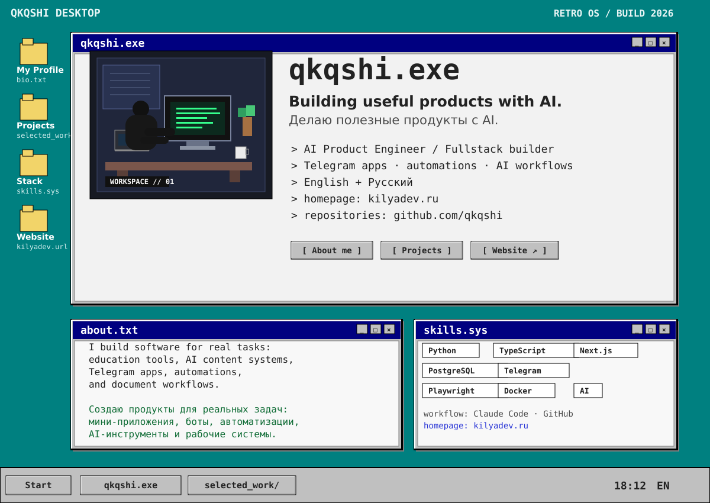
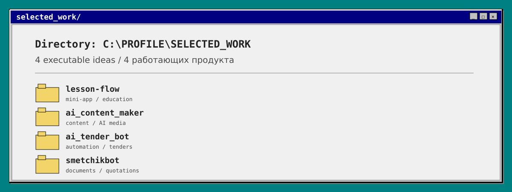
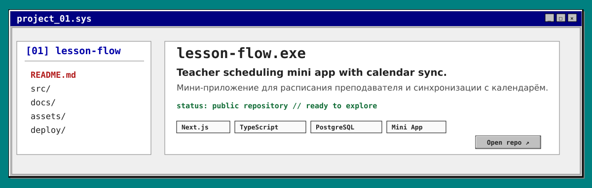
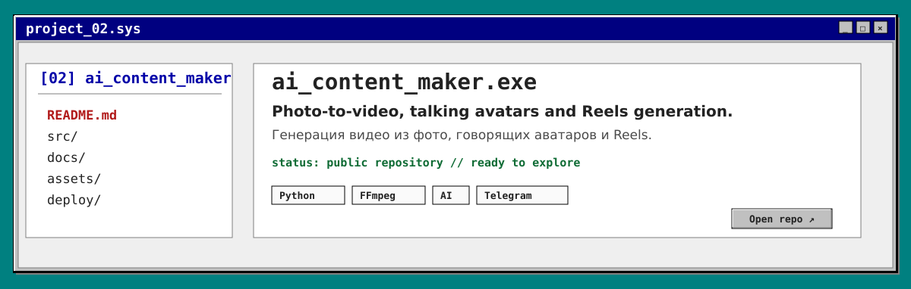
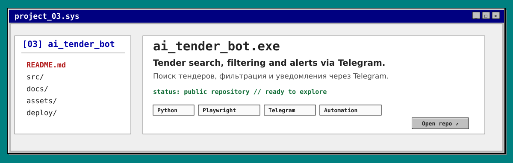
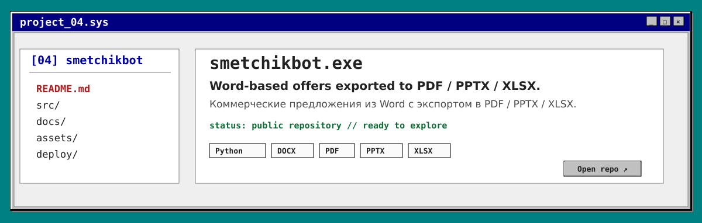
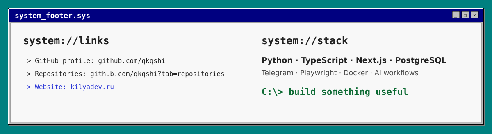

<!-- QKQSHI / Retro OS — SVG-only, GitHub-compatible -->

  

<table><tr><td width="50%" valign="top">

### `C:\PROFILE\ABOUT.TXT`

I build software products for real-world workflows — from education tools and AI content systems to Telegram automations and document pipelines.

**Focus:** product engineering, automation, useful interfaces.

</td><td width="50%" valign="top">

### `C:\PROFILE\ОБО_МНЕ.TXT`

Я создаю цифровые продукты для реальных задач — от образовательных инструментов и AI-систем для контента до Telegram-автоматизаций и документооборота.

**Фокус:** разработка продуктов, автоматизация, полезные интерфейсы.

</td></tr></table>

[**WEBSITE ↗ / САЙТ ↗**](https://kilyadev.ru) · [**GITHUB PROFILE ↗**](https://github.com/qkqshi) · [**ALL REPOSITORIES ↗ / ВСЕ РЕПОЗИТОРИИ ↗**](https://github.com/qkqshi?tab=repositories)

 

`C:\USERS\QKQSHI>` **run portfolio.exe**

Retro OS edition. / Версия в стиле Retro OS.

