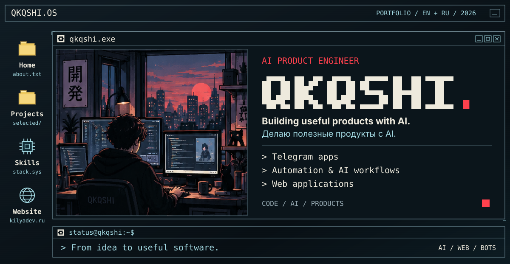
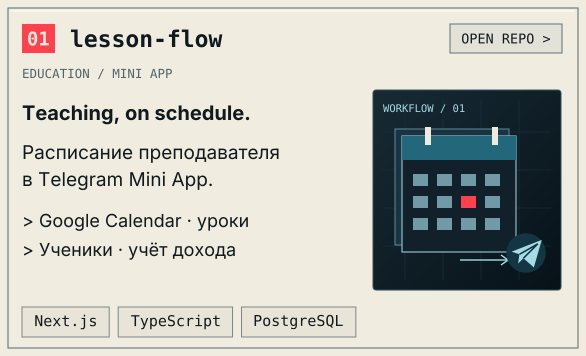
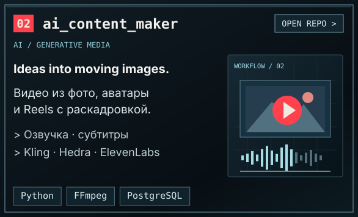
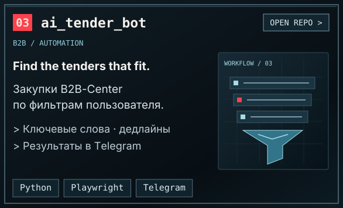
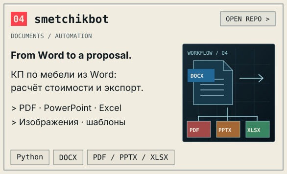
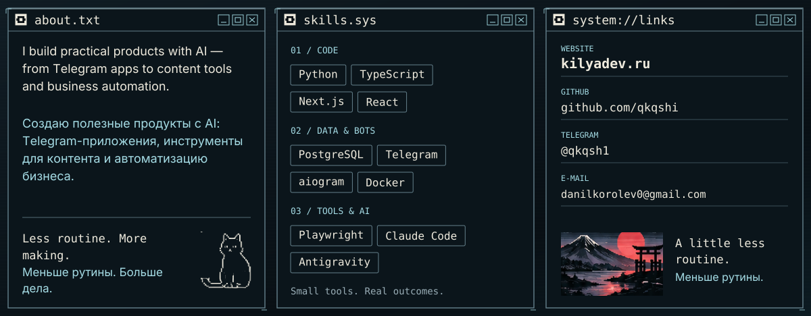

<!-- QKQSHI.OS / Retro Terminal edition. All resources are local. -->
<!-- Graphic windows are decoration. The navigation and project cards below are real links. -->

<picture>
  <source media="(max-width: 600px)" srcset="./assets/os-hero-mobile.svg">
  
</picture>

<picture>
  <source media="(max-width: 600px)" srcset="./assets/os-selected-work-mobile.svg">
  
</picture>

<a href="https://github.com/qkqshi/lesson-flow"><picture>
  <source media="(max-width: 600px)" srcset="./assets/os-project-01-mobile.svg">
  
</picture></a>
<a href="https://github.com/qkqshi/ai_content_maker"><picture>
  <source media="(max-width: 600px)" srcset="./assets/os-project-02-mobile.svg">
  
</picture></a>
<a href="https://github.com/qkqshi/ai_tender_bot"><picture>
  <source media="(max-width: 600px)" srcset="./assets/os-project-03-mobile.svg">
  
</picture></a>
<a href="https://github.com/qkqshi/smetchikbot"><picture>
  <source media="(max-width: 600px)" srcset="./assets/os-project-04-mobile.svg">
  
</picture></a>

<picture>
  <source media="(max-width: 600px)" srcset="./assets/os-info-mobile.svg">
  
</picture>

Text version / Текстовая версия

<h3>About / ОБО МНЕ</h3>

I build practical products with AI — from Telegram apps to content tools and business automation.

Создаю полезные продукты с AI: Telegram-приложения, инструменты для контента и автоматизацию бизнеса.

<h3>Selected work / ИЗБРАННЫЕ ПРОЕКТЫ</h3>
<h4><a href="https://github.com/qkqshi/lesson-flow">01 / lesson-flow</a></h4>

A teacher’s Telegram Mini App with Google Calendar sync, lesson editing, student tracking and income planning. Telegram Mini App преподавателя: синхронизация с Google Calendar, управление уроками, список учеников и планирование дохода.

<strong>Stack:</strong> Next.js / TypeScript / PostgreSQL

<h4><a href="https://github.com/qkqshi/ai_content_maker">02 / ai_content_maker</a></h4>

A Telegram bot for photo-to-video generation, talking avatars and storyboard Reels. Uses Kling, Hedra, ElevenLabs, FFmpeg and PostgreSQL. Telegram-бот для видео из фото, говорящих аватаров и Reels с раскадровкой. Использует Kling, Hedra, ElevenLabs, FFmpeg и PostgreSQL.

<strong>Stack:</strong> Python / FFmpeg / PostgreSQL

<h4><a href="https://github.com/qkqshi/ai_tender_bot">03 / ai_tender_bot</a></h4>

Find and filter B2B-Center tenders by keywords, participants and deadlines, then receive matching results in Telegram. Includes Playwright fallback. Поиск закупок B2B-Center по ключевым словам, числу участников и дедлайнам. Подходящие результаты отправляются в Telegram; предусмотрен Playwright fallback.

<strong>Stack:</strong> Python / Playwright / Telegram

<h4><a href="https://github.com/qkqshi/smetchikbot">04 / smetchikbot</a></h4>

Generate furniture quotations from Word documents, calculate costs and export PDF, PowerPoint and Excel files through Telegram. Коммерческие предложения по мебели из Word: расчёт стоимости и экспорт в PDF, PowerPoint и Excel через Telegram.

<strong>Stack:</strong> Python / DOCX / PDF / PPTX / XLSX

<h3>Stack</h3>

Python, TypeScript, Next.js, React, PostgreSQL, Telegram, aiogram, Docker, Playwright. AI tools: Claude Code, Antigravity.

<h3>Contact / КОНТАКТЫ</h3>

<a href="https://kilyadev.ru">kilyadev.ru</a> &middot; <a href="https://github.com/qkqshi">GitHub</a> &middot; <a href="https://t.me/qkqsh1">@qkqsh1</a> &middot; <a href="mailto:danilkorolev0@gmail.com">danilkorolev0@gmail.com</a>

<em>Project illustrations show workflows, not product screenshots. Иллюстрации проектов показывают процессы, а не скриншоты интерфейсов.</em>

